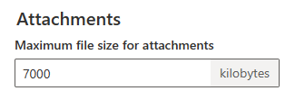
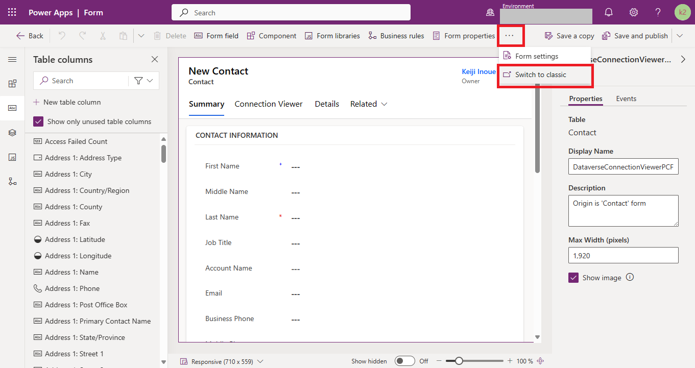
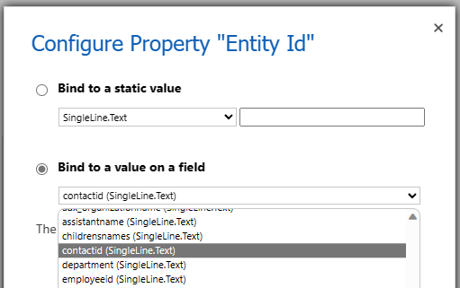
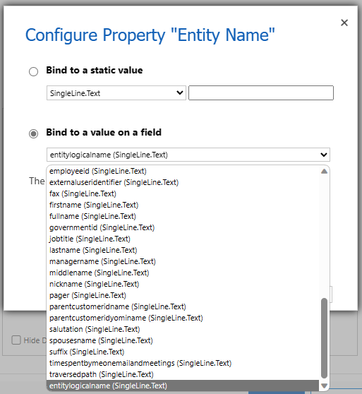

# How to set up

1. This PCF control works only on forms in model-driven apps. It doesn't work with canvas apps.
1. Download the latest solution file (.zip) from [Releases](https://github.com/keijiinouehotmail/DataverseConnectionViewerPCF/releases) of this repository.
1. In [https://make.powerapps.com/ ↗️](https://make.powerapps.com/) with a user who has the Customize permission, select an appropriate environment and import the solution file.
    - If you see an error like the following, you need to do additional settings.
      ```text
      Solution "Dataverse Connection Viewer PCF" failed to import: Import Solution Failed: CustomControl with name CV.ConnectionViewer failed to import with error: Webresource content size is too big.
      ```
    - Open [https://admin.powerplatform.microsoft.com/ ↗️](https://admin.powerplatform.microsoft.com/).
    - Click "Environments" on the left navigation, and select your environment.
    - Click "Settings" on the menu -> "Email" -> "Email settings"
    - In "Attachments", change "Maximum file size for attachments" from `5120` in default to `7000` or so.
    - 
    - Click "Save".
1. Display the screen to customize the form of any table (for example, "Contact").
1. Click "Switch to classic" on the menu to display the classic form editor.
    - 
1. On the classic form, place any text field where you want to display this PCF control.
    - Note that this field will not be changed by this PCF control.
    - Note that if you place the primary field, you will have trouble removing it from the form later, so it is recommended to place a field other than the primary field.
1. Double-click the field to display the field property window.
1. Click the `Controls` tab.
1. Click `Add Control...`.
1. Find "ConnectionViewer" and add it.
1. Set the following property group of "ConnectionViewer".
    - Entity Id
      - Click "Bind to a valu on a field" as shown in the following figure, and select the field that is the unique identifier of the target table.
      - 
      - For example, for the "Contact" table, select the `contactid` field.
    - Entity Name
      - Click "Bind to a value on a field" as shown in the following figure, and select the `entitylogicalname` field.
      - 
    - Height (px)
      - Specify the height in pixels of the area where this PCF control is displayed on the form.
      - For example, enter `600`.
      - 
    - Config Set
      - Enter the JSON-formatted text of which table data to visualize as a connection viewer.
      - By leaving the value blank without specifying it, the following settings will be applied as the default.
        ```json
        {
          "ConfigArray": [
            {
              "ID": "Sales",
              "Description": "This is a configuration for the sales department. Accounts and contacts, as well as opportunities as connection records.",
              "SmallerSizeEnabled": true,
              "DefaultCardsLayoutDescription": "Cards layout for sales department",
              "IsDefault": true,
              "EntitiesForConnectionList": [
                "account",
                "contact",
                "opportunity"
              ],
              "RelationshipSchemaNameList": [
                "contact_customer_accounts",
                "account_parent_account"
              ]
            },
            {
              "ID": "Service",
              "Description": "This is a configuration for the service department. This includes accounts, contacts, and cases.",
              "SmallerSizeEnabled": true,
              "DefaultCardsLayoutDescription": "Cards layout for service department",
              "IsDefault": false,
              "EntitiesForConnectionList": [
                "account",
                "contact",
                "incident"
              ],
              "RelationshipSchemaNameList": [
                "contact_customer_accounts",
                "account_parent_account",
                "incident_customer_accounts",
                "incident_customer_contacts"
              ]
            }
          ]
        }
        ```
      - Optionally, you can edit the JSON text above and enter the JSON text for this property with your own settings intended.
        - "ConfigArray"
          - Holds an array with objects representing multiple configuration information as elements. You can edit the elements of this array.
        - "ID"
          - Sets the ID of the configuration information.
        - "Description"
          - Sets the description text of the configuration information.
        - "SmallerSizeEnabled"
          - Sets the value true or false whether to use the feature to display the size of the card far from the card focused (by clicking, etc.) smaller.
        - "DefaultCardsLayoutDescription"
          - Sets the default text of the description to be attached to the saved card layout.
        - "IsDefault"
          - Sets the value true or false whether to use as the default configuration information among multiple configuration information in "ConfigArray".
        - "EntitiesForConnectionList"
          - Sets an array that holds the logical names of the tables that are the targets of the `connection` records to be displayed in the connection viewer.
        - "RelationshipSchemaNameList"
          - Sets an array that holds the schema names of the relationships that are the targets of the `1:N relationship`, `N:1 relationship`, or `N:N relationship` records to be displayed in the connection viewer.
        - ⚠️ Please note the presence or absence of commas "," when adding or deleting elements.
        - ⚠️ To check the schema name of the relationship, it is easy to use Metadata Tools.
          - [https://learn.microsoft.com/en-us/power-apps/developer/data-platform/browse-your-metadata ↗️](https://learn.microsoft.com/en-us/power-apps/developer/data-platform/browse-your-metadata)
      
    - Standalone Demo
      - Set whether to use the sample demo mode or not.
      - If you want to use the connection viewer using the sample data hard-coded in this PCF control, set `1`. If you want to use the actual data stored in Dataverse, set `0`.
    - Enable Node Scoring
      - Set `1` if you want to use the feature to score the strength of the connection between the cards displayed in the connection viewer, or `0` if not.
    - Azure OpenAI API Key
      - If you want to use the feature to ask questions about the cards displayed in the connection viewer and get answers using the ChatGPT API, set the Azure OpenAI API key.
      - If you do not want to use this feature, you do not need to set a value.
      - Also, if you want to use this feature, you need to specify the following Azure OpenAI API Endpoint URL.
    - Azure OpenAI API Endpoint URL
      - Set an Endpoint URL like the following.
        ```text
        https://{your-resource-name}.openai.azure.com/openai/deployments/{your-model-deployment-name}/completions?api-version=2023-07-01-preview
        ```
      - This is a valid setting if you specify the Azure OpenAI API Key described above.
1. After all the properties are set, for the `ConnectionViewer` control, check the Web, Phone, Tablet checkbox as shown in the following figure.
    - 
1. Click the `Display` tab in the field property window and uncheck the `Display label on the form` checkbox.
    - 
    - This setting is optional.
1. Click `OK` in the field property window to close it.
1. In the form editor, click `Save` and then click `Publish` to publish it.

## Attention
- It is not intended to place multiple of this PCF control on one form.
- It is assumed that the user will operate the mouse on a PC as a device. Touch interactions have not been tested.
- If you want to use the sample demo mode, that is, if you specify `1` for `Standalone Demo`, it is assumed that it is intended for tables that are used in Dynamics 365, not Dataverse alone.
- The default value in `Config Set` is also assumed to be intended for tables used in Dynamics 365.


